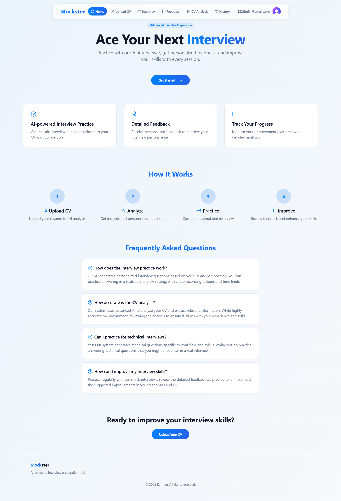

# Redesign  GP with a modern vibe coding and handle the backend tasks.

**Mock Interview App with CV Analysis**

This app helps users prepare for real-world job interviews by simulating mock interview sessions and providing detailed feedback. Users can upload their CVs, which are analyzed using AI to identify strengths, weaknesses, and areas for improvement. The app then tailors interview questions based on the user's experience and job goals, offering personalized practice and performance analytics to boost interview confidence.

